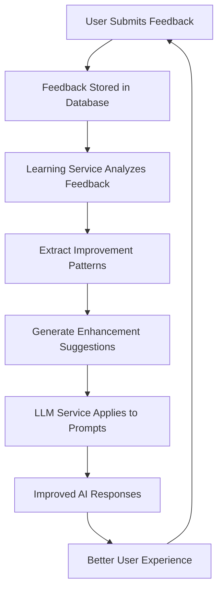

# AI Learning Integration Documentation

## Overview

VulnPatch AI now features an advanced AI learning system that continuously improves responses based on user feedback. This system integrates user feedback data with the Gemini LLM service to enhance analysis quality over time.

## Architecture

### Components

1. **Feedback Service** (`app/services/feedback_service.py`)
   - Collects and analyzes user feedback
   - Generates improvement insights
   - Extracts learning patterns from comments

2. **AI Learning Service** (`app/services/ai_learning_service.py`)
   - Orchestrates feedback integration with AI models
   - Manages learning cache and improvements
   - Provides learning status and analytics

3. **Enhanced Gemini LLM Service** (`app/services/gemini_llm_service.py`)
   - Integrates feedback improvements into prompts
   - Applies learned enhancements to AI responses
   - Maintains learning cache for performance

## How It Works

### 1. Feedback Collection

Users provide feedback through multiple channels:
- **Vulnerability Analysis Feedback**: Rating and comments on vulnerability assessments
- **AI Assistant Feedback**: Rating and corrections for chat responses
- **Analysis Type Feedback**: Specific feedback for business impact, patch recommendations, etc.

```python
# Example: User submits feedback via API
POST /api/v1/vulnerabilities/{vuln_id}/feedback
{
  "rating": 4,
  "comment": "Good analysis but needs more specific remediation steps",
  "is_helpful": true
}
```

### 2. Learning Pattern Extraction

The feedback service analyzes comments to identify improvement areas:

```python
improvement_patterns = {
    "accuracy": ["wrong", "incorrect", "inaccurate", "mistake"],
    "completeness": ["missing", "incomplete", "more detail", "shallow"],
    "relevance": ["irrelevant", "not relevant", "off-topic", "not helpful"],
    "speed": ["slow", "takes too long", "timeout", "delayed"],
    "clarity": ["confusing", "unclear", "hard to understand", "complicated"]
}
```

### 3. Prompt Enhancement

Based on feedback analysis, the system enhances AI prompts:

```python
def _enhance_prompt_with_feedback(self, base_prompt: str, analysis_type: str) -> str:
    if analysis_type not in self.learned_improvements:
        return base_prompt
    
    learning_data = self.learned_improvements[analysis_type]
    
    # Add improvement suggestions
    suggestions = learning_data.get("learning_signals", {}).get("improvement_suggestions", [])
    if suggestions:
        base_prompt += "\nBased on user feedback, please focus on:\n"
        for suggestion in suggestions[:3]:
            base_prompt += f"- {suggestion}\n"
    
    return base_prompt
```

### 4. Continuous Learning

The system automatically:
- Loads feedback improvements on startup
- Refreshes learning cache periodically
- Applies feedback insights to all analysis types

## API Endpoints

### Learning Management

#### Apply Feedback Learning
```http
POST /api/v1/ai/learning/apply/{analysis_type}
```
Applies feedback learning to improve specific analysis type.

#### Get Learning Status
```http
GET /api/v1/ai/learning/status
```
Returns current learning status, feedback analytics, and improvement insights.

#### Refresh Learning Cache
```http
POST /api/v1/ai/learning/refresh
```
Refreshes the learning cache with latest feedback data.

#### Load Analysis Improvements
```http
POST /api/v1/ai/learning/load/{analysis_type}
```
Loads feedback-based improvements for specific analysis type.

### Feedback Analytics

#### Get Feedback Analytics
```http
GET /api/v1/ai/feedback/analytics?days=30
```
Returns feedback statistics and performance metrics.

#### Get Improvement Insights
```http
GET /api/v1/ai/feedback/insights
```
Returns AI improvement insights based on user feedback.

#### Get Feedback Trends
```http
GET /api/v1/ai/feedback/trends?days=90
```
Returns feedback trends over time.

## Analysis Types

The system supports learning for multiple analysis types:

1. **vulnerability_assessment** - Core vulnerability analysis
2. **business_impact** - Business impact assessments  
3. **patch_recommendation** - Patch prioritization and recommendations
4. **query** - General AI assistant responses

## Learning Process Flow



## Performance Impact

### Positive Impacts
- **Response Quality**: Continuous improvement based on real user feedback
- **User Satisfaction**: AI responses become more relevant and helpful over time
- **Accuracy**: Learning from mistakes reduces incorrect assessments

### Optimization Features
- **Caching**: Learning improvements are cached for performance
- **Selective Loading**: Only relevant improvements are loaded per analysis type
- **Batched Processing**: Feedback analysis is performed efficiently

## Configuration

### Environment Variables
```bash
# AI Learning is automatically enabled when feedback service is available
# No additional configuration required
```

### Database
The system uses the existing feedback table with these key fields:
- `rating` - 1-5 star rating
- `comment` - Detailed feedback text
- `is_helpful` - Boolean helpfulness indicator
- `feedback_type` - Type of feedback (vulnerability, analysis, query)
- `analysis_type` - Specific analysis type being rated

## Monitoring

### Learning Metrics
Monitor learning effectiveness through:

```python
# Get learning status
learning_status = await ai_learning_service.get_learning_status()

# Monitor feedback analytics  
analytics = await ai_learning_service.get_feedback_analytics(days=30)

# Track improvement insights
insights = await ai_learning_service.get_improvement_insights()
```

### Key Metrics
- **Average Rating by Analysis Type**: Track improvement in user satisfaction
- **Feedback Volume**: Monitor user engagement with feedback system
- **Learning Cache Performance**: Ensure efficient prompt enhancement
- **Improvement Application Success**: Track learning integration effectiveness

## Best Practices

### For Administrators
1. **Regular Learning Refresh**: Refresh learning cache weekly or after significant feedback volume
2. **Monitor Feedback Quality**: Review feedback comments for actionable insights
3. **Analysis Type Focus**: Apply learning to analysis types with lower ratings first
4. **Performance Monitoring**: Track response quality improvements over time

### For Users
1. **Detailed Feedback**: Provide specific comments about what needs improvement
2. **Consistent Rating**: Use ratings consistently across similar content
3. **Constructive Comments**: Focus on actionable improvements rather than general complaints

## Troubleshooting

### Common Issues

#### Learning Service Not Initializing
```python
# Check if database connection is available
# Verify feedback service can access feedback table
# Ensure proper permissions for learning operations
```

#### Low Learning Effectiveness
```python
# Verify feedback volume is sufficient (>10 entries per analysis type)
# Check feedback quality (comments with specific improvement suggestions)
# Ensure learning cache is being refreshed regularly
```

#### Performance Issues
```python
# Monitor learning cache size and hit rates
# Optimize feedback analysis frequency
# Consider feedback data retention policies
```

## Future Enhancements

### Planned Features
1. **Machine Learning Integration**: Use ML models for pattern recognition in feedback
2. **A/B Testing**: Test different prompt variations based on feedback
3. **Real-time Learning**: Apply improvements immediately after feedback submission
4. **Cross-Analysis Learning**: Apply insights from one analysis type to related types

### Advanced Analytics
1. **Sentiment Analysis**: Analyze feedback sentiment for deeper insights
2. **Topic Modeling**: Identify common improvement themes automatically
3. **Predictive Metrics**: Predict which analysis types need attention

## Conclusion

The AI learning integration transforms VulnPatch AI from a static analysis tool into a continuously improving system that learns from every user interaction. This ensures that the quality of vulnerability assessments, business impact analyses, and patch recommendations improves over time, providing increasingly valuable insights to security teams.

The system's design prioritizes:
- **User Experience**: Better responses through continuous learning
- **Performance**: Efficient caching and selective improvement application  
- **Transparency**: Clear feedback analytics and learning status
- **Reliability**: Robust error handling and fallback mechanisms

This creates a feedback loop where user engagement directly improves the system's capability, making VulnPatch AI more effective with each use.